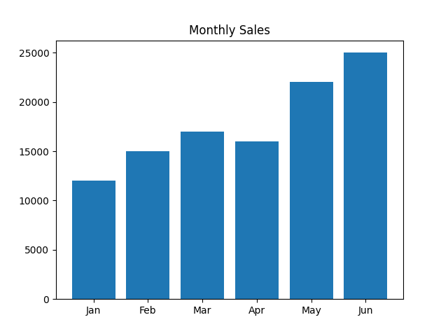
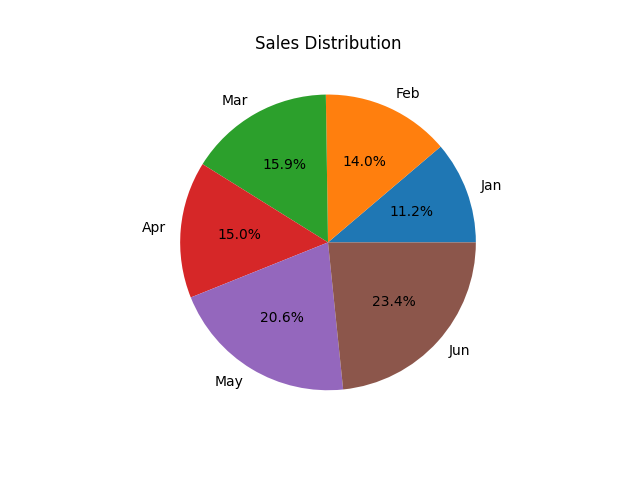
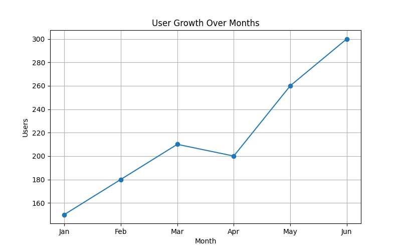
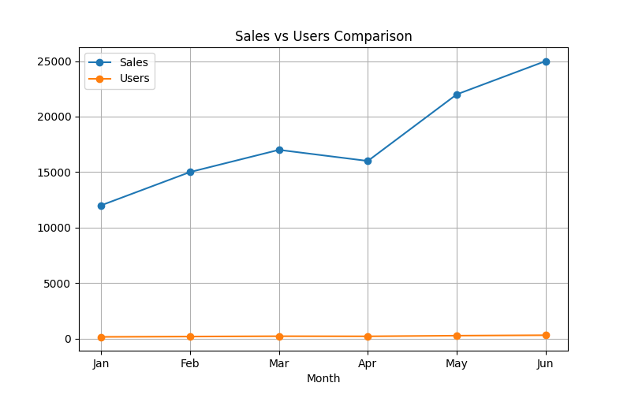

# Smart Infographics Generator

## Overview
This project converts simple dataset values into visual charts like bar and pie charts using Python.

## Features
- Reads CSV data
- Generates bar chart
- Generates pie chart
- Helps understand data visually

## Tools Used
- Python
- Pandas
- Matplotlib

## Output

### Bar Chart

### Pie Chart

### Line Chart

### Comparision chart

## Author
Yash Kumar
